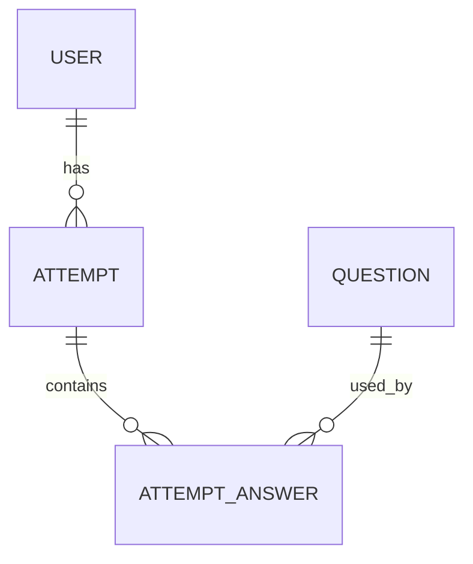

# Level Assessment Exam Platform

[](https://github.com/nazmusshakib878/Assessment-Exam-platform-/actions/workflows/ci.yml)

A full-stack, role-based level assessment platform. Students register, take a balanced ten-question assessment, resume saved progress, and receive a score and level. Administrators manage the question bank and view submitted results.

## Stack

- Backend: Laravel 12, PHP 8.2+, Sanctum, SQLite/MySQL, PHPUnit
- Frontend: Next.js 16, React 19, TypeScript, Tailwind CSS 4

## Setup

### Backend

macOS/Linux:

```bash
cd backend
composer install
cp .env.example .env
php artisan key:generate
touch database/database.sqlite
php artisan migrate:fresh --seed
php artisan serve
```

Windows PowerShell:

```powershell
cd backend
composer install
Copy-Item .env.example .env
php artisan key:generate
New-Item -ItemType File -Force database/database.sqlite
php artisan migrate:fresh --seed
php artisan serve
```

The API runs at `http://localhost:8000` by default.

### Frontend

macOS/Linux:

```bash
cd frontend
npm install
cp .env.example .env.local
npm run dev
```

Windows PowerShell:

```powershell
cd frontend
npm install
Copy-Item .env.example .env.local
npm run dev
```

Open `http://localhost:3000`.

## Environment variables

Frontend:

```env
NEXT_PUBLIC_API_URL=http://localhost:8000
```

For separate frontend/backend deployments set `FRONTEND_URL` to the frontend origin and configure `SANCTUM_STATEFUL_DOMAINS` only when using Sanctum cookie authentication. This project uses bearer tokens; Laravel remains the authorization authority. The frontend `auth_present` and `auth_role` cookies are non-sensitive routing hints only.

## Test credentials

| Role | Email | Password |
| --- | --- | --- |
| Admin | `admin@example.com` | `password` |
| Student | `student1@example.com` | `password` |
| Student | `student2@example.com` | `password` |

## API endpoints

| Method | Path | Role | Purpose |
| --- | --- | --- | --- |
| POST | `/api/register` | Public | Register a student |
| POST | `/api/login` | Public | Receive a Sanctum token |
| POST | `/api/logout` | Authenticated | Revoke current token |
| GET | `/api/user` | Authenticated | Current user |
| GET/POST | `/api/attempts` | Student | Results / start assessment |
| GET | `/api/attempts/{id}` | Owner student | Retrieve saved assessment |
| PATCH | `/api/attempts/{id}/answers` | Owner student | Save progress |
| POST | `/api/attempts/{id}/submit` | Owner student | Submit assessment |
| CRUD | `/api/admin/questions` | Admin | Manage questions |
| GET | `/api/admin/results` | Admin | Submitted results |

## Data model



## Tests and checks

```bash
cd backend && php artisan test
cd frontend && npm run lint && npm run build
```

The Postman collection is at [docs/postman_collection.json](docs/postman_collection.json).

## Optional Docker development

```bash
docker compose up --build
```

This starts MySQL, Laravel, and Next.js. For local non-Docker work, SQLite is the simplest option.

## Live demo / deployment

Host the API on Render, Railway, or Fly.io and use a managed MySQL/Postgres database. Set `APP_ENV=production`, `APP_DEBUG=false`, `APP_KEY`, database credentials, `FRONTEND_URL`, and CORS origin settings on the API host. Set Vercel `NEXT_PUBLIC_API_URL` to the public API URL and redeploy the frontend. SQLite on ephemeral hosts resets on redeploy, so use a managed database or deliberately seed on startup.

## Decisions and improvements

- Each attempt stores stable question and option ordering, while the server maps selected option identifiers back for grading.
- Scoring, score bands, transactions, and row locking live in one backend service.
- Auth endpoints are throttled and API failures use one JSON envelope.
- Routing-hint cookies avoid protected-page flashes; Sanctum role checks remain authoritative.
- A future production improvement is secure HTTP-only cookie authentication instead of browser-held bearer tokens.